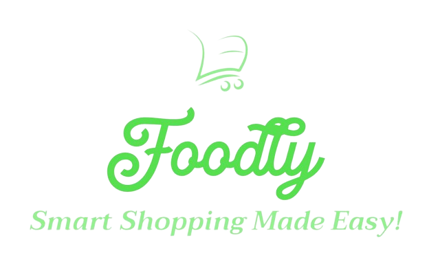

Foodly - Smart Shopping Made Easy!
Whether you're a busy parent, a health-conscious individual, or someone who loves to cook, our grocery list app is your ultimate companion for stress-free shopping and meal planning. Download now and revolutionize the way you shop for groceries!

Introducing the Ultimate Grocery List App:

🍎 Keep Your Pantry Fresh: 
   Say goodbye to wasted food! Our app features spoilage timers for each grocery item. When the timer runs out, items automatically move to a suggested list for easy reordering, ensuring your pantry stays stocked with fresh ingredients.

👨‍👩‍👧‍👦 Collaborative Shopping Made Easy:
   Share your grocery lists with family or roommates effortlessly! Our collaborative lists feature lets you invite others to join and contribute, making grocery shopping a team effort.

🥑 Personalized Experience:
   Input your dietary restrictions and allergies to tailor your grocery list to your specific needs. Easily filter out items that don't align with your dietary preferences, ensuring a hassle-free shopping experience.

🗂️ Customizable Categories:
   Organize your grocery items just the way you like! Our app allows you to customize categories, making it easy to find what you need when you're at the store.

✨ Simple, Intuitive Interface:
   Our user-friendly design ensures that navigating the app is a breeze. With a clean and attractive interface, managing your grocery lists has never been more enjoyable.

